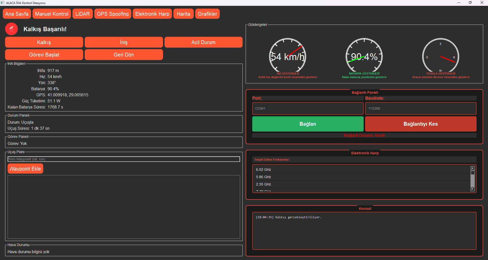
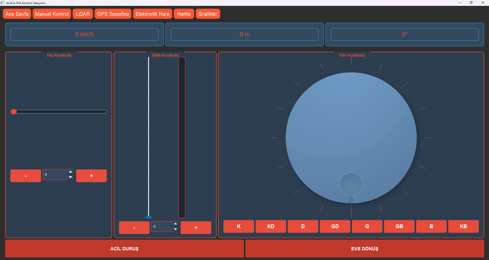
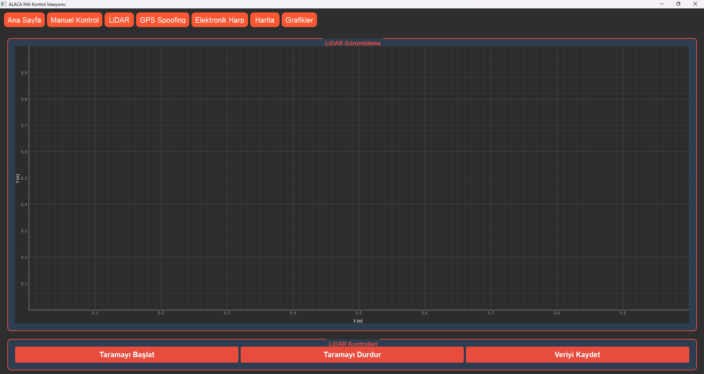
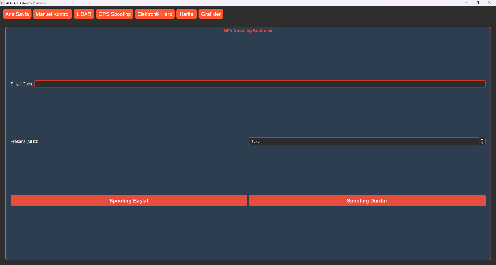
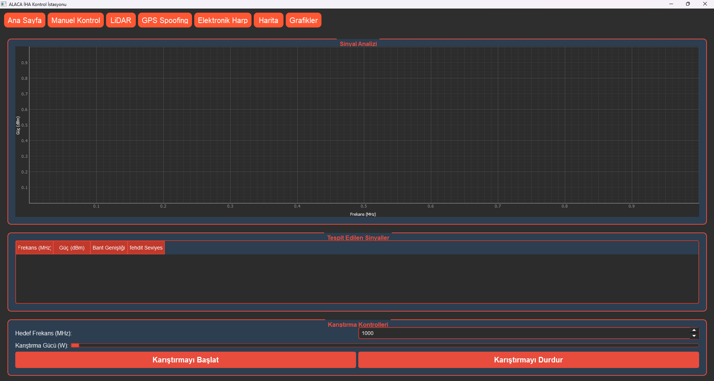
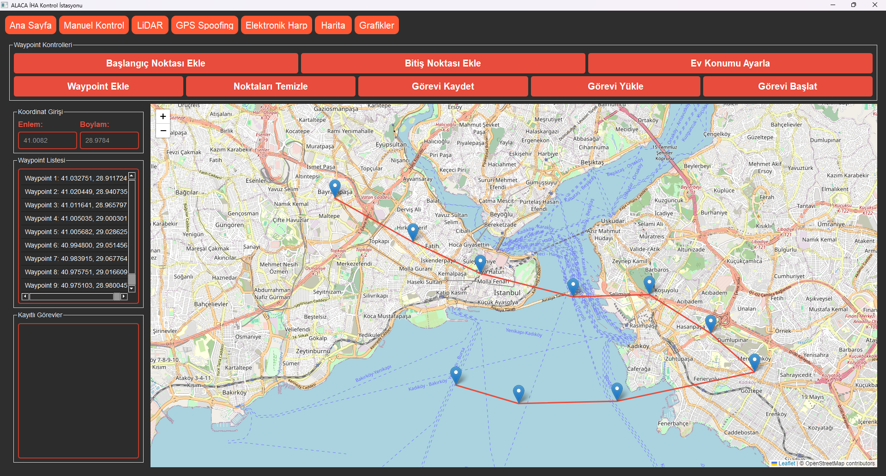
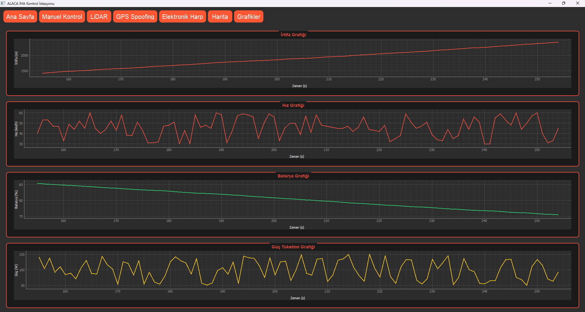

## Özellikler



### Ana Sayfa
- Gerçek zamanlı telemetri göstergeleri
- Hız göstergesi
- Batarya durumu
- Pusula
- İHA durum bilgileri
- Uçuş kontrolleri
- Konsol çıktıları


### Manuel Kontrol
- İHA'nın manuel kontrolü
- Hassas hız ayarı
- İrtifa kontrolü
- Yön kontrolü
- 

### LiDAR
- LiDAR tarama kontrolü
- Nokta bulutu görüntüleme
- Veri kaydetme


### GPS Spoofing
- GPS sinyal kontrolü
- Frekans ayarları
- Sinyal gücü kontrolü


### Elektronik Harp
- Sinyal analizi
- Frekans tespiti
- Karıştırma kontrolü
- Tehdit analizi


### Harita
- Waypoint ekleme
- Başlangıç/bitiş noktası belirleme
- Ev konumu ayarlama
- Görev planlama
- Görev kaydetme/yükleme


### Grafikler
- İrtifa grafiği
- Hız grafiği
- Batarya durumu
- Güç tüketimi

## Kullanım Kılavuzu

### Ana Sayfa
- Kalkış/İniş butonları ile uçuşu kontrol edin
- Telemetri verilerini takip edin
- Acil durum butonunu gerektiğinde kullanın

### Harita Kullanımı
1. Haritaya tıklayarak waypoint ekleyin
2. Başlangıç ve bitiş noktalarını belirleyin
3. Ev konumunu ayarlayın
4. Görevi kaydedin
5. Gerektiğinde kaydedilmiş görevleri yükleyin

### Manuel Kontrol
- Hız, irtifa ve yön kontrollerini kullanın
- Göstergeleri takip edin

### Elektronik Harp
- Sinyal analizini başlatın
- Tespit edilen sinyalleri görüntüleyin
- Karıştırma parametrelerini ayarlayın

## Güvenlik Özellikleri
- Acil durum butonu
- Otomatik eve dönüş
- Batarya seviyesi uyarıları
- Bağlantı durumu kontrolü

## Teknik Özellikler
- Kırmızı tema tasarımı
- Modüler yapı
- Gerçek zamanlı veri işleme
- İnteraktif harita sistemi
- Gelişmiş görev planlama

## Geliştirici Notları
- WebChannel ile harita entegrasyonu
- Gerçek zamanlı veri simülasyonu
- Modüler sayfa yapısı
- Özelleştirilebilir arayüz


## Kurulum
pip install -r requirements.txt
## Sorun Giderme

### Sık Karşılaşılan Hatalar
1. "ModuleNotFoundError": Gerekli kütüphaneler eksik
   ```bash
   pip install PyQt5 PyQtWebEngine pyqtgraph requests
   ```

2. "ImportError: DLL load failed": PyQt5 kurulumu hatalı
   ```bash
   pip uninstall PyQt5 PyQtWebEngine
   pip install PyQt5 PyQtWebEngine
   ```

3. "QWebEngine" hatası: PyQtWebEngine eksik
   ```bash
   pip install PyQtWebEngine
   ```

## İletişim
Essirius
[baygutdogukan@gmail.com]

## Lisans
Bu yazılım Doğukan AVCI tarafından geliştirilmiştir. Tüm hakları saklıdır.
